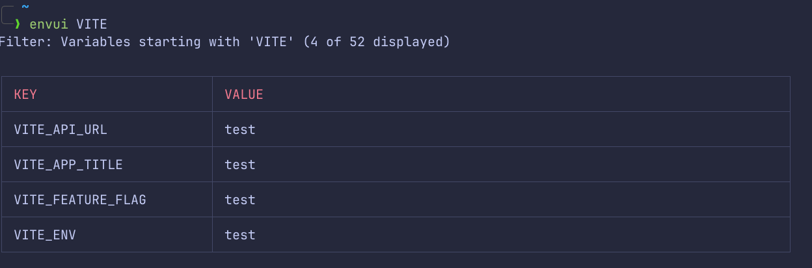
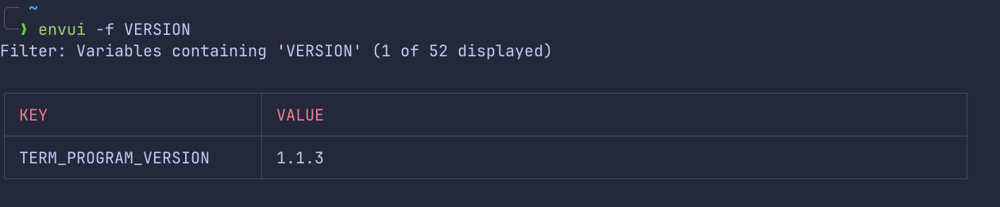

# envui


Beautiful environment variable viewer - A modern alternative to `printenv`

## About

envui is a CLI tool that displays environment variables in a clean, readable table format with color highlighting. It's designed to be a more user-friendly alternative to the traditional `printenv` command.

## Requirements

- Node.js ≥ 18

## Installation

```bash
npm install -g @flowernotfound/envui
```

## Usage

```bash
# Display all environment variables
envui
```

```bash
# Prefix filtering (case-insensitive)
envui VITE_
envui NODE_
```

Demo output:



```bash
# Filter by partial match (case-insensitive)
envui --filter API
envui -f API
envui --filter database
envui -f database
```

Demo output:



```bash
# Display help
envui --help

# Show version
envui --version
```

## License

[MIT license](https://github.com/flowernotfound/envui/blob/master/LICENSE)
